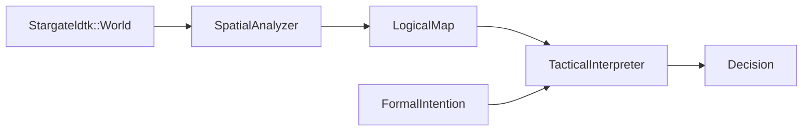

# Specification: Tactical Interpreter (v1.x)

## Purpose
The `TacticalInterpreter` is the primary consumer of the **Stargateldtk** infrastructure. It transforms spatial knowledge (`LogicalMap`) and a formal `Intention` into a structured **Decision**.

## Fundamental Laws

### 1. Law of Non-Execution
The Interpreter **never** modifies the game state. It returns data, not behavior.

### 2. Law of Formal Intention
The `Intention` is a formal and immutable data object. No informal types are allowed.
- `Intention::Reach[target: [gx, gy]]`
- `Intention::Avoid[tag: :hazard]`
- `Intention::Hold[]`

### 3. Law of Structured Traceability
Every decision must include a `reason` which is a comparable and auditable data structure, not free-form text.
- Example: `reason: { rule: :path_blocked, type: :hazard }`

### 4. Law of Synchronicity (Temporal Integrity)
The Interpreter will reject any `LogicalMap` whose version does not match the actor's context or the current request.
- `fail if map.world_version != required_version`

### 5. Law of Impossibility (Failure Handling)
If an intention cannot be logically resolved, the Interpreter must return an explicit impossibility state. It must never fail silently or return a dangerous partial decision.
- `Decision::Hold` or `Decision::Fail`

## Reasoning Interface

### Input
- `map`: Validated and synchronized `LogicalMap`.
- `intention`: Formal `Intention` object.
- `context`: Actor data (e.g., current position).

### Output
- `Decision`: Immutable Hash or Struct containing:
    - `type`: `:move`, `:hold`, `:fail`, etc.
    - `payload`: Specific data (coordinates, etc.).
    - `reason`: Hash with logical justification.

## Data Flow

